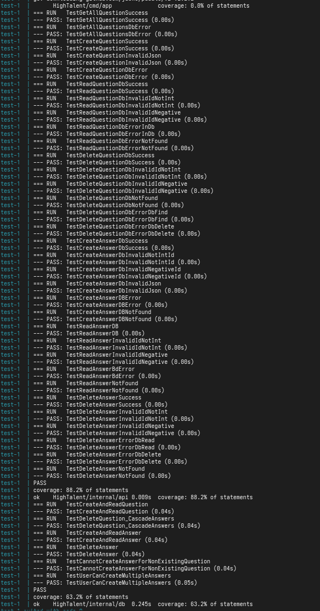
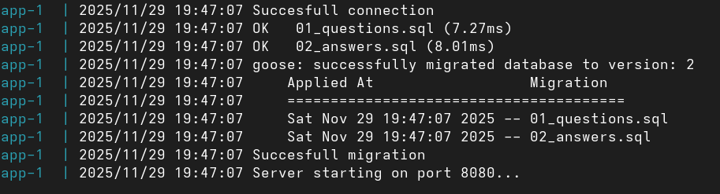
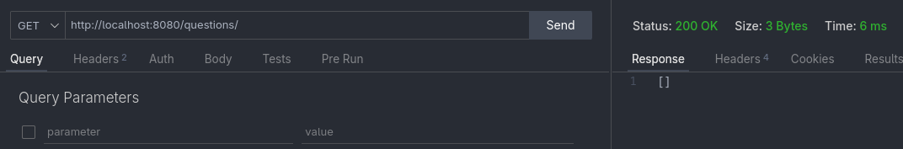
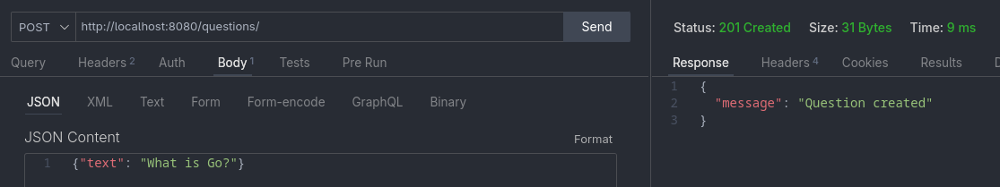
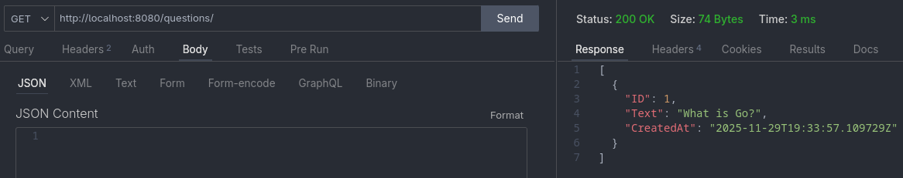
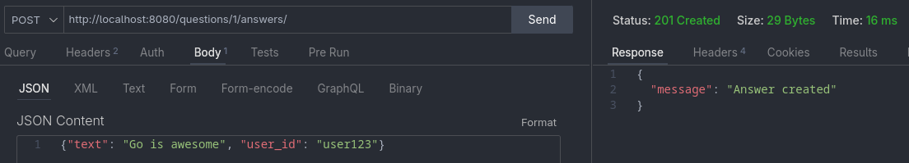
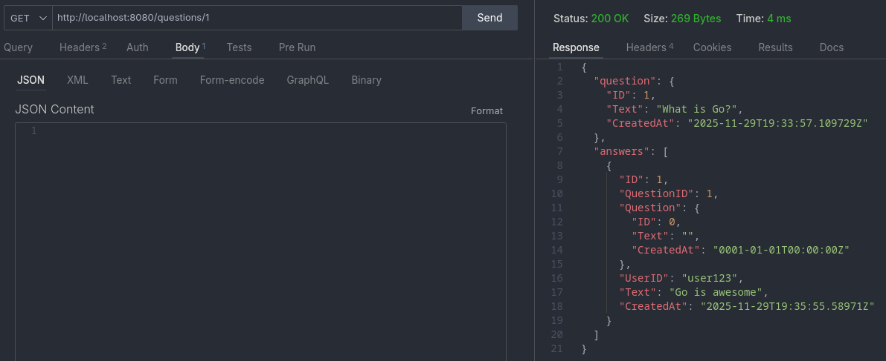
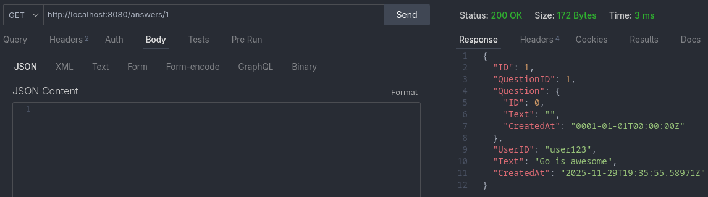
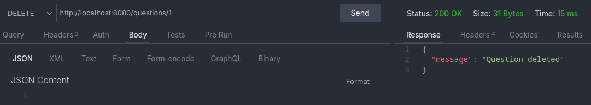
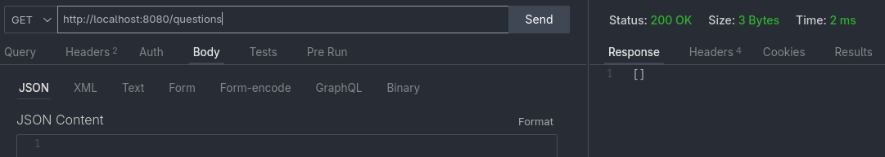

# Как запустить данный API сервис:

1. На host OS должен быть установлен `Docker` (желательно последней версии) и работать `docker compose`

2. Приложение состоит из 4 контейнеров:

   - `API сервис`
   - `Тесты`
   - `База данных для сервиса`
   - `База данных для тестов`

3. Убедитесь, что у вас установлен `Makefile`

4. Есть 3 команды: для тестирования, запуска сервиса и очистки базы данных для сервиса

## Тестирование

Для запуска тестов можно выполнить `make test`

Что запустится?

1.  Тесты из файла: `internal/api/handlers_test.go` - они тестируют правильность ответов и статусов

2.  Тесты из файла `internal/db/crud_test.go` - они тестируют правильность бизнес-логики

Вы должны увидеть следующее:



## Очистка базы данных

`make reset-db`

Заметьте, что очищается база, которая взаимодействует с сервисом, а не с тестами

База, которая взаимодействуют с тестами самостоятельно очищается в коде тестов

## Запуск сервиса

Для запуска сервиса можно выполнить `make app`

Вы должны увидеть что-то похожее, на следующее:



Тогда вы готовы к тому, чтобы работать с сервисом

Все запросы и ответы должны быть в формате `JSON`

Ниже опишем интерфейс для каждого из методов при корректной работе сервиса:

a. `GET /questions/`

`request`: пустой

`response`: список из json-структур Question

b. `POST /questions/`

`request` : структура вида

```json
{
  "text": "YourQuestion"
}
```

(замените `YourQuestion` на свой вопрос)

При корректной обработке:

`response` : структура

```json
{
  "message": "Question created"
}
```

При этом в таблицу `questions` в базу данных вставляется новая строка

c. `GET /questions/{id}`

`request` : пустой

`response` : структура вида

```json
{
  "question": FoundQuestionStructure,
  "answers": []FoundAnswerStructureList
}
```

(то есть найденный вопрос находится по ключу "questions", а все список всех ответов по ключу "answers")

d. `DELETE /questions/{id}`

`request` : пустой

`response` : структура вида

```json
{
  "message": "Question deleted"
}
```

При этом из таблицы `questions` удаляется строка с таким id

Все ответы на этот вопрос из таблицы `answers` удаляются каскадно

e. `POST /questions/{id}/answers/`

`request` : структура вида

```json
{
  "text": "YourAnswer",
  "user_id": "YourId"
}
```

(замените `YourAnswer` на свой ответ, а `YourId` на свой user_id)

`response` : структура

```json
{
  "message": "Answer created"
}
```

Пример из ThunderClient extension для vs code:

f. `GET /answers/{id}`

`request` : пустой

`response` : структура Answer являющаяся искомым ответом

g. `DELETE /answers/{id}`

`request` : пустой

`response` : структура

```json
{
  "message": "Answer deleted"
}
```

При этом из таблицы `answers` удаляется строка с таким id

!!!Важно:

1. Все created_at заполняются автоматически по текущему времени.
2. Все пути должны вводиться точно также, как это записано в задании
   (путь с лишними или отствующими `/` или грамматическими ошибками работает с неопределённым поведением)

Вот готовый пример в терминале:
(Перед этим в другом терминале запустите `make reset-db` и `make app`)

```bash
#1. Список вопросов (пусто)
curl http://localhost:8080/questions/

#2. Создать вопрос
curl -X POST http://localhost:8080/questions/ \
  -H "Content-Type: application/json" \
  -d '{"text": "What is Go?"}'

#3. Список вопросов (1 вопрос)
curl http://localhost:8080/questions/

#4. Создать ответ
curl -X POST "http://localhost:8080/questions/1/answers/" \
  -H "Content-Type: application/json" \
  -d '{"text": "Go is awesome", "user_id": "user123"}'

#5. Вопрос + ответы
curl http://localhost:8080/questions/1

#6. Получить ответ
curl http://localhost:8080/answers/1

#7. Удалить вопрос (каскадно)
curl -X DELETE http://localhost:8080/questions/1


#8. Проверить (пусто)
curl http://localhost:8080/questions/
```

Этот же пример в ThunderClient

### 1

#

### 2



### 3



### 4



### 5



### 6



### 7



### 8


